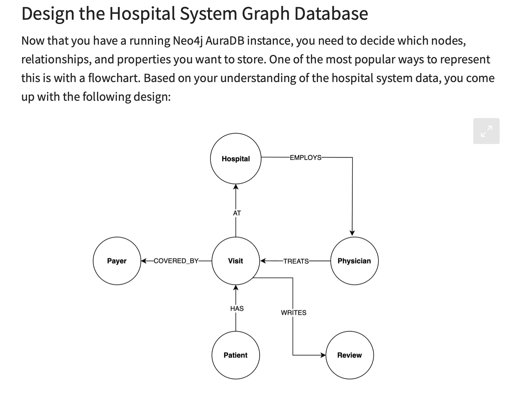
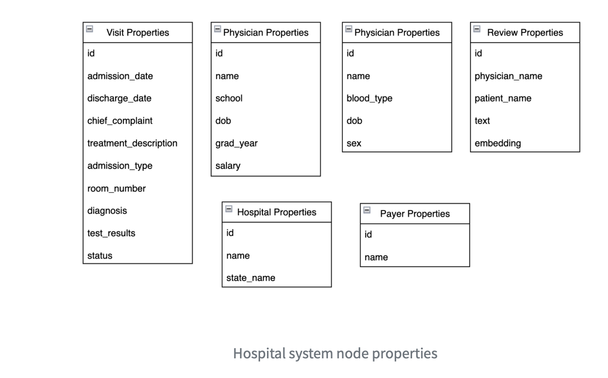
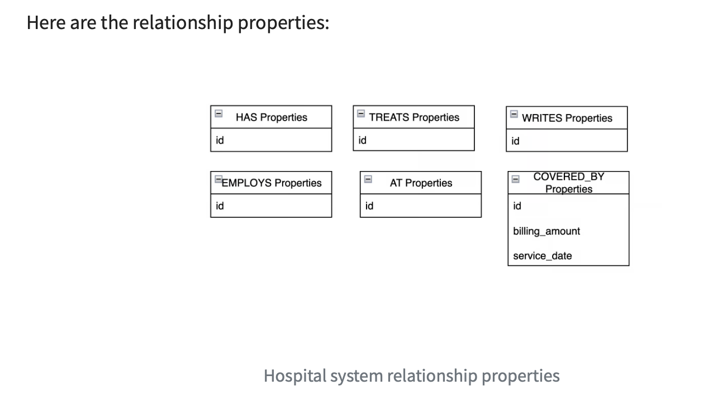

# llm_rag_openai_neo4j
Build a RAG chatbot in LangChain that uses Neo4j to retrieve data about the patients, patient experiences, hospital locations, visits, insurance payers, and physicians in your hospital system.

# Links
- [Build an LLM RAG Chatbot With LangChain](https://realpython.com/build-llm-rag-chatbot-with-langchain/)
- [Source code](https://github.com/realpython/materials/tree/master/langchain-rag-app/)
- [source code for embeddings-and-vector-databases-with-chromadb](https://github.com/realpython/materials/tree/master/embeddings-and-vector-databases-with-chromadb/)
- [FastAPI Documentation for Hospital Chatbot](http://localhost:8000/docs#/)
- [Final Chatbot URL](http://localhost:8501)

# Data
- [HOSPITALS_CSV_PATH](https://raw.githubusercontent.com/hfhoffman1144/langchain_neo4j_rag_app/main/data/hospitals.csv)
- [PAYERS_CSV_PATH](https://raw.githubusercontent.com/hfhoffman1144/langchain_neo4j_rag_app/main/data/payers.csv)
- [PHYSICIANS_CSV_PATH](https://raw.githubusercontent.com/hfhoffman1144/langchain_neo4j_rag_app/main/data/physicians.csv)
- [PATIENTS_CSV_PATH](https://raw.githubusercontent.com/hfhoffman1144/langchain_neo4j_rag_app/main/data/patients.csv)
- [VISITS_CSV_PATH](https://raw.githubusercontent.com/hfhoffman1144/langchain_neo4j_rag_app/main/data/visits.csv)
- [REVIEWS_CSV_PATH](https://raw.githubusercontent.com/hfhoffman1144/langchain_neo4j_rag_app/main/data/reviews.csv)

# Graph Database
## Hospital System Graph Database

## Hospital system node properties

## Hospital system relationship properties

# Notes
- If you have a toml file, you can install using this in a venv using pip by : python -m pip install .
- To deploy and run on local docker : docker-compose up --build